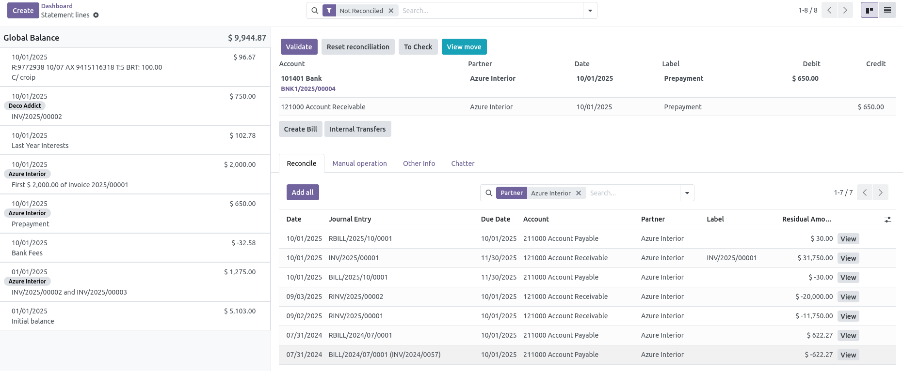
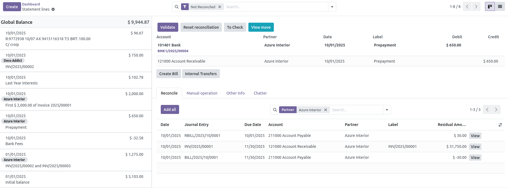

This module improve account reconciliation module. Once installed,
accounting user can reduce reconciliation proposition made by Odoo,
filtering only on the current account of the given journal.

This setting is made on each journal.

- Don't set value for 'Bank Reconcile Account Allowed':

- Set value:

