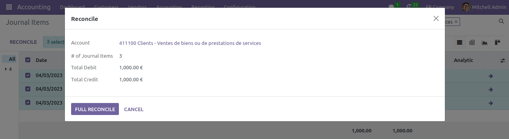
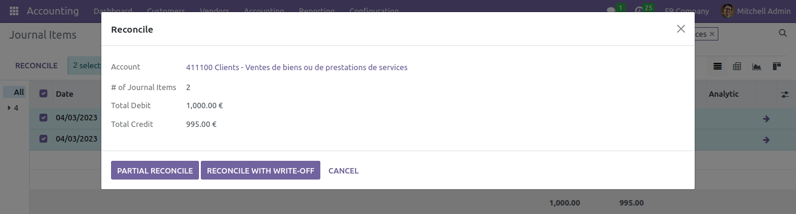
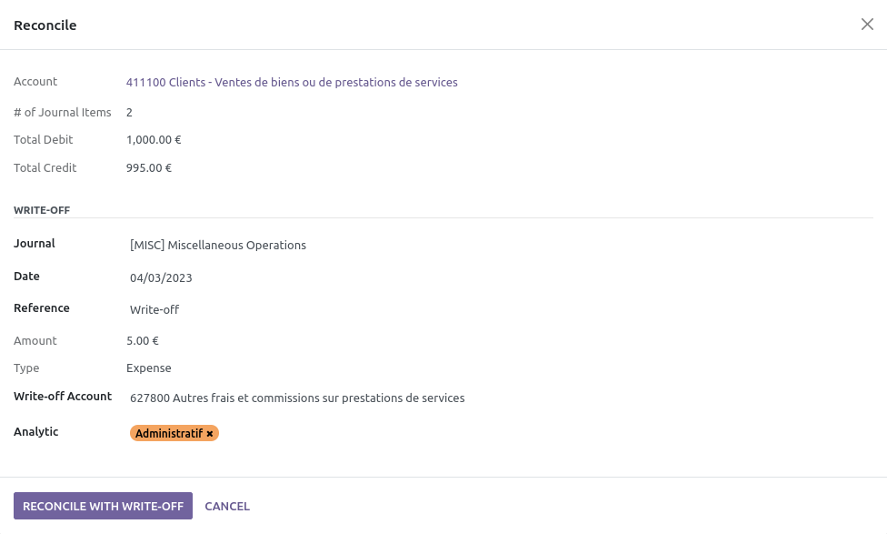

This module adds a wizard to reconcile manually selected journal items. If the selected journal items are balanced, it will propose a full reconcile. Otherwise, the user will have to choose between partial reconciliation and full reconciliation with a write-off.

For the old-time Odoo users, the feature provided by this module is similar to the wizard that was provided in the **account** module up to Odoo 11.0. It was later replaced by the special reconciliation JS interface, which was working well, but was not as fast and convenient.

Full reconciliation:

Choose between partial reconciliation and full reconciliation with a write-off:

Reconcile with write-off:

