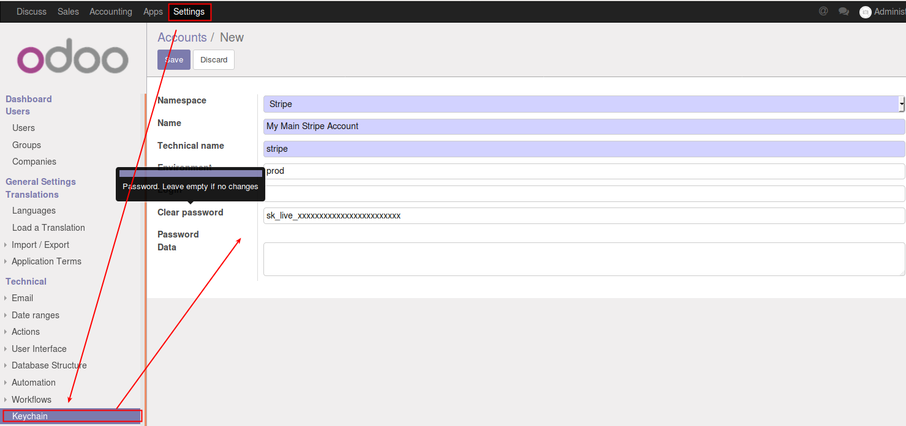
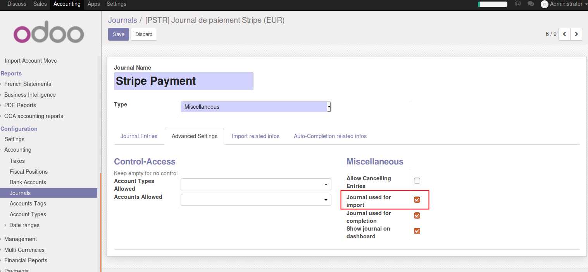
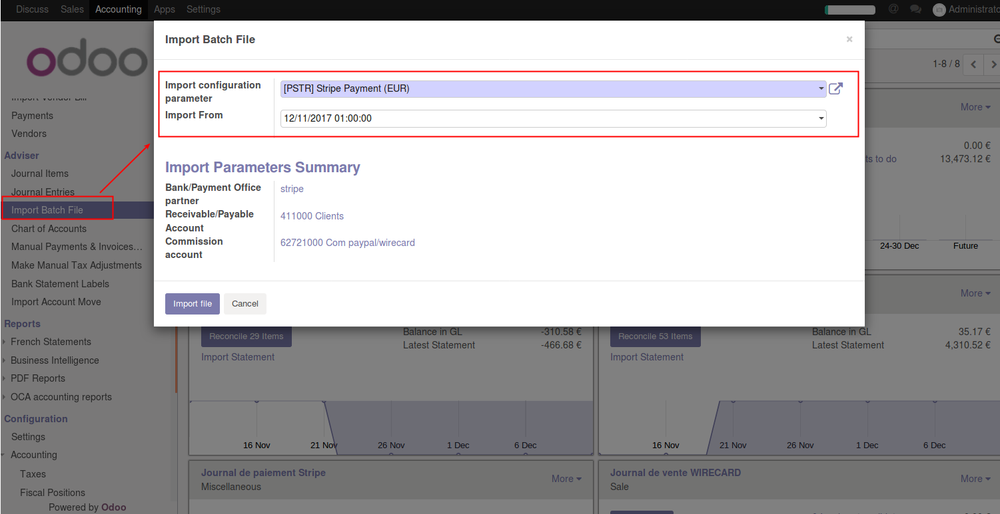

.. image:: https://img.shields.io/badge/license-AGPL--3-blue.png
   :target: https://www.gnu.org/licenses/agpl
   :alt: License: AGPL-3

==========================
Account Move Stripe Import
==========================

This module will import your stripe payout in order to process the reconciliation with the invoice.
You can import it manually or automatically

Installation
============

Installation will required to have the module keychain installed with a key configured.
See keychain module for installation and configuration : https://github.com/OCA/server-tools/blob/10.0/keychain/README.rst

Configuration
=============

Setup your stripe information in a keychain account:

#. Go to Setting > Technical > Keychain

.. figure:: account_move_stripe_import/static/description/configure_keychain.png
   :alt: .
   :width: 600 px

Then create a new journal for importing the payment:

#. Go to Accounting > Configuration > Accounting > Journals

.. figure:: account_move_stripe_import/static/description/create_journal.png
   :alt: .
   :width: 600 px

You can also configure a task to import the payout automatically

#. Go to Setting > Technical > Automation > Scheduled Actions and active the cron "Import Stripe Deposit/Payout"

Usage
=====

To use this module, you need to:

#. Go to Accounting > Adviser > Import Batch File

.. figure:: account_move_stripe_import/static/description/import_move.png
   :alt: .
   :width: 600 px

.. image:: https://odoo-community.org/website/image/ir.attachment/5784_f2813bd/datas
   :alt: Try me on Runbot
   :target: https://runbot.odoo-community.org/runbot/98/10.0

Known issues / Roadmap
======================

Roadmap linked to the dependency
----------------------------------

* Better interface for apikey (we should improve keychain)
* Better way to support cart deposit
  Maybe we should create a new type of journal with type "deposit" and a specific widget in the dashbord

Bug Tracker
===========

Bugs are tracked on `GitHub Issues
<https://github.com/OCA/account-reconcile/issues>`_. In case of trouble, please
check there if your issue has already been reported. If you spotted it first,
help us smash it by providing detailed and welcomed feedback.

Credits
=======

Images
------

* Odoo Community Association: `Icon <https://odoo-community.org/logo.png>`_.

Contributors
------------

* Sébastien Beau <sebastien.beau@akretion.com> (www.akretion.com)

Do not contact contributors directly about support or help with technical issues.

Funders
-------

The development of this module has been financially supported by:

* Adaptoo
* La Cimade

Maintainer
----------

.. image:: https://odoo-community.org/logo.png
   :alt: Odoo Community Association
   :target: https://odoo-community.org

This module is maintained by the OCA.

OCA, or the Odoo Community Association, is a nonprofit organization whose
mission is to support the collaborative development of Odoo features and
promote its widespread use.

To contribute to this module, please visit https://odoo-community.org.
