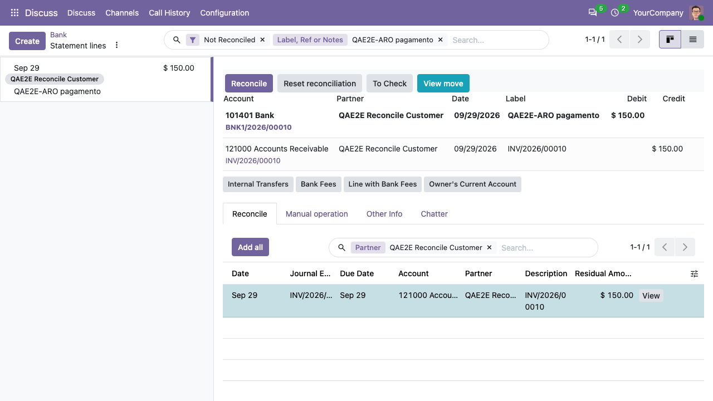

## Bank reconcile

Access *Invoicing > Dashboard* with a user with *Show Full Accounting
Features*. On the bank journal of your choice, click *Reconcile*.

The statement lines to reconcile are listed on the left. Select one: on
the right, the *Reconcile* tab lists the open journal items of the
partner. Click on the items that match the statement line (for instance
the receivable line of the invoice): they are added to the
reconciliation. Then click *Reconcile*.

The *Manual operation* tab allows to create a counterpart on any account,
and the reconcile models of the journal are available as buttons.

## Account reconcile

Access *Invoicing > Accounting > Reconcile*. All the possible
reconcile options will show and you will be able to reconcile properly.
You can access the same widget from accounts and Partners.
