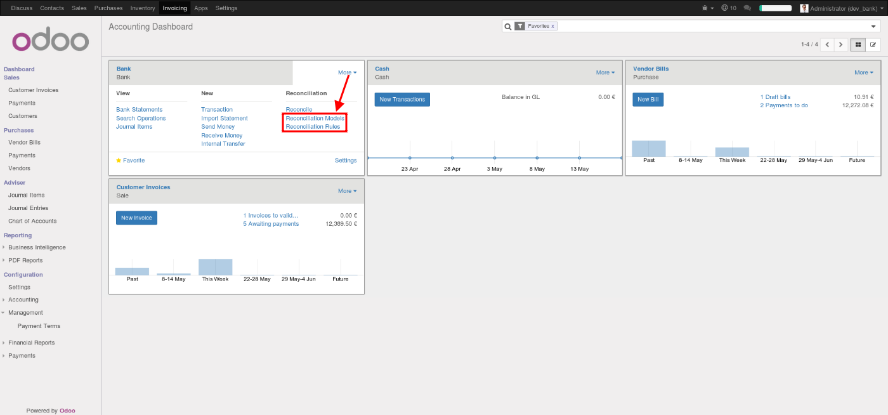
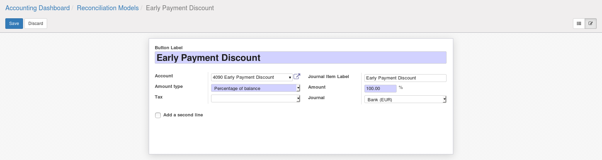
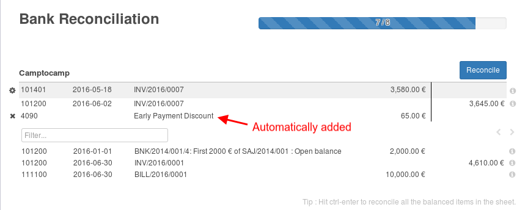

.. image:: https://img.shields.io/badge/license-AGPL--3-blue.png
   :target: https://www.gnu.org/licenses/agpl
   :alt: License: AGPL-3

=================================================
Account Reconcile Rule for Early Payment Discount
=================================================

Extends the module *Account Reconcile Rules* with a new rule type :
**Early Payment Discount**.

It allows to automatically create a write-off
entry for the amount paid by the customers when they received dunning
fees (using the **Account Credit Control** module).

Usage
-----

1. Look at  ``account_early_payment_discount``
module in the project: https://github.com/OCA/account-payment
to configure payment terms with an early payment discount.

-----

2. Configure some ``Reconciliation Models`` in
``Invoicing > Dashboard > Bank Card > Reconciliation Models``

-----

3. Then configure a new Reconciliation Rule in
``Invoicing > Dashboard > Bank Card > Reconciliation Rules``

.. image:: docs/rule.png

-----

4. Then during reconciliation, if a bank statement line matches an invoice which has a
payment term configured with early payment discount, this rule will verify if
the remaining balance respects the early payment discount rules
(discount percentage and payment delay).
If true, the remaining balance will be automatically reconciled in the configured account.

.. image:: https://odoo-community.org/website/image/ir.attachment/5784_f2813bd/datas
   :alt: Try me on Runbot
   :target: https://runbot.odoo-community.org/runbot/98/11.0

Dependencies
------------

This module only works with the ``account_early_payment_discount``
module in the project: https://github.com/OCA/account-payment

Credits
=======

Images
------

* Odoo Community Association: `Icon <https://odoo-community.org/logo.png>`_.

Contributors
------------

* Cyril Gaudin <cyril.gaudin@camptocamp.com>
* Akim Juillerat <akim.juillerat@camptocamp.com>

Maintainer
----------

.. image:: https://odoo-community.org/logo.png
   :alt: Odoo Community Association
   :target: https://odoo-community.org

This module is maintained by the OCA.

OCA, or the Odoo Community Association, is a nonprofit organization whose
mission is to support the collaborative development of Odoo features and
promote its widespread use.

To contribute to this module, please visit https://odoo-community.org.
