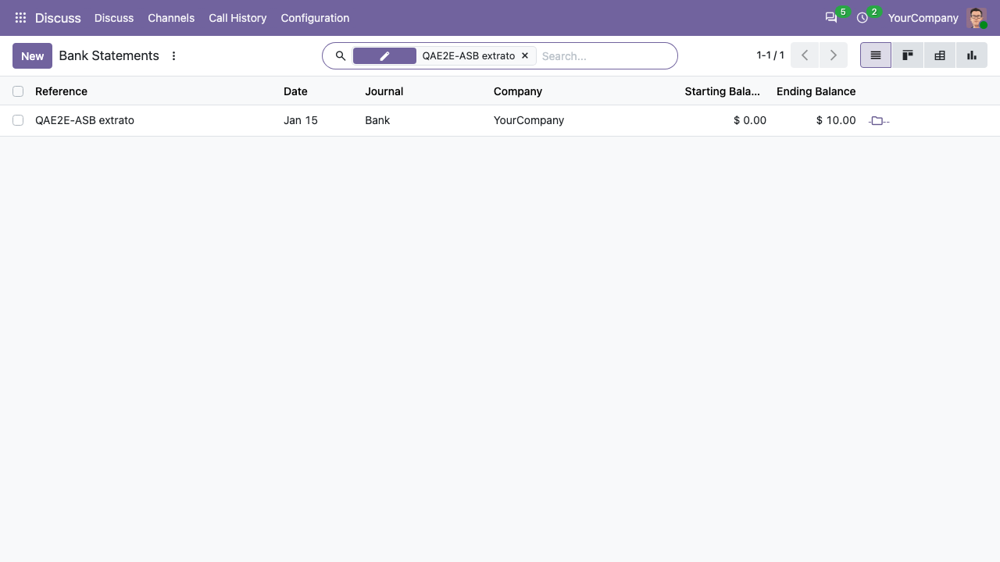
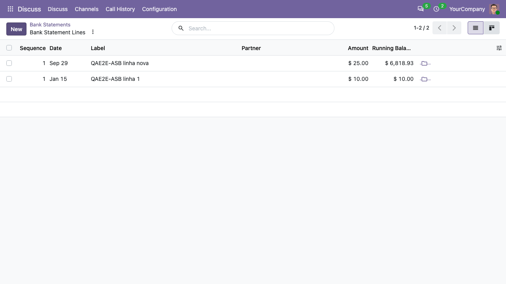

Users need the *Show Full Accounting Features* access right.

In *Invoicing > Dashboard*, open the menu of a bank journal and click
*Statements*. With this module, the list of bank statements allows to
create statements, and each statement has an *Open Statement Lines*
button (folder icon) at the end of the line:

The button opens the editable list of the lines of that statement.
Click *New* to add a transaction (label and amount); the new line is
created in the opened statement and in its journal:

On each line, the buttons at the end allow to revert the reconciliation
of the line and to open its journal entry.
